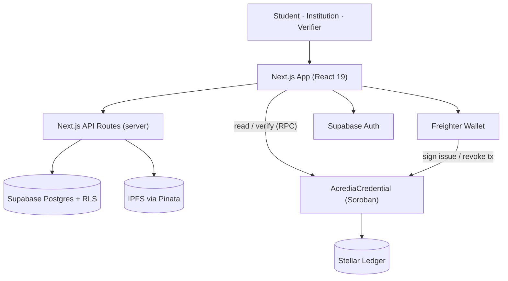

# Acredia — Architecture

How Acredia is put together, what each component is responsible for, and how data flows through the system for the three core operations: **issue**, **verify**, and **revoke**.

> Acredia runs on **Stellar testnet**. Mainnet is a configuration switch away (see the [README](../README.md) and [backlog](../ISSUE_DRAFTS.md)).

---

## 1. Component overview

| Component | Tech | Responsibility |
|---|---|---|
| **Frontend** | Next.js 16 (App Router), React 19, Tailwind v4 | Marketing site, dashboards, verification UI; also hosts server API routes. |
| **Auth** | Supabase Auth | Email/password sessions, JWTs; role is resolved server-side (never from client metadata alone). |
| **Wallet** | Freighter (`@stellar/freighter-api`) | Connects a Stellar account and signs `issue_credential` / `revoke_credential` transactions. |
| **Smart contract** | Rust + Soroban SDK (`AcrediaCredential`) | On-chain source of truth: issuance, issuer authorization, revocation, TTL/persistence, events. |
| **Ledger / RPC** | Stellar (testnet), Soroban RPC, Horizon | Transaction settlement and contract reads. |
| **Storage** | IPFS via Pinata | Stores the credential document + metadata (public today; encryption is on the roadmap). |
| **Database** | Supabase Postgres + Row Level Security | Off-chain index for fast reads, filtering, pagination, and analytics; stores profiles, institution/student records, credential index, and privacy-safe verification logs. |

---

## 2. Layers

1. **Presentation** — one role-aware console (`ConsoleShell` + `src/lib/consoleNav.ts`) serving students, institutions, and admins, plus a public verify page. Design system built on Tailwind v4 tokens + Radix primitives. Admins have a single console at `/admin`; `/dashboard` redirects them there — see [decisions/0001](decisions/0001-single-admin-console.md).
2. **Application** — Next.js API routes handle privileged work server-side: student/institution provisioning, wallet linking, admin stats, IPFS pinning, and verification logging. Server-only secrets never reach the client bundle.
3. **Blockchain** — the `AcrediaCredential` Soroban contract is the authoritative record. It gates issuance behind owner-approved issuer authorization and keeps credentials persistent via explicit TTL extension.
4. **Storage** — documents/metadata are content-addressed on IPFS; only a hash + IPFS URI are anchored on-chain.
5. **Data** — Postgres mirrors on-chain state for querying, protected by Row Level Security so users can only read their own rows (with admin policies for oversight).

---

## 3. Database Management & Migrations

Acredia manages the PostgreSQL schema, seed data, and backups using the **Supabase CLI**.

- **Migrations**: The database schema is defined as versioned migrations in `frontend/supabase/migrations/`. 
  - To apply migrations locally, run `npx supabase db push` or simply `npx supabase start`.
  - To create a new migration: `npx supabase migration new <descriptive-name>`.
- **Seed Data**: Dummy users, institutions, and credentials for local development are managed in `frontend/supabase/seed.sql`. When starting a local Supabase environment, the seed data is populated automatically.
- **Backups & Restore**: Automated logical backups can be run via npm scripts:
  - `npm run db:backup` -> Dumps the current `public` schema and data into `frontend/supabase/backups/`.
  - `npm run db:restore path/to/backup.sql` -> Restores a logical dump to the database (requires `psql` or the Supabase CLI).

---

## 3. Trust & security model

- **On-chain is the source of truth.** The database is a convenience index; verification ultimately rests on the contract + hash.
- **Only a hash goes on-chain** — no PII. The SHA-256 hash is computed over the canonical credential payload; verification recomputes and compares it.
- **Issuer authorization is owner-gated.** Only the contract owner can `authorize_issuer`; only authorized addresses can issue; only the issuing address can revoke its own credentials.
- **Role resolution is server-side.** UI role never grants privilege on its own; API routes and Postgres RLS enforce access.
- **Server secrets stay server-side.** Service-role key, Pinata JWT, and the verification-log hash secret are never exposed as `NEXT_PUBLIC_*`.

See the [roadmap backlog](../ISSUE_DRAFTS.md) for planned hardening: encrypting IPFS payloads, distributed rate limiting, an off-chain event indexer, and an independent contract audit.

---

## 4. Data flows

### 4.1 Issue a credential
1. A **verified institution** connects its Stellar wallet (Freighter), which is linked to the institution profile.
2. The registrar fills the issuance form (student wallet, degree, subjects, document).
3. The document + metadata are **pinned to IPFS** (via a server API route using the Pinata JWT), returning an IPFS URI/CID.
4. A **SHA-256 hash** is computed over the canonical credential payload.
5. The issuer **signs `issue_credential(student, issuer, credential_hash, ipfs_uri)`**; the contract verifies the issuer is authorized, rejects duplicate hashes, assigns a `token_id`, stores the credential in persistent storage, extends its TTL, and emits a `cred_iss` event.
6. The credential is **indexed in Postgres** for the student's and institution's dashboards.

### 4.2 Verify a credential
1. Anyone opens `/verify` with a token ID (typed, from a link, or scanned QR) — **no login required**.
2. The app **reads the credential from the contract** via Soroban RPC (`get_credential` / `verify_credential`).
3. It presents **authenticity + revocation status** and the credential details.
4. A **privacy-safe entry** (hashed identifiers) is recorded in `verification_logs`.
5. *(Roadmap)* an explicit **integrity check** recomputes the hash of the retrieved payload and confirms the IPFS CID matches the on-chain record.

### 4.3 Revoke a credential
1. The **original issuing institution** connects the same wallet that issued the credential.
2. It **signs `revoke_credential(token_id, issuer)`**; the contract confirms the caller is the issuer and flags the credential `revoked` (the record stays readable so verifiers see **"revoked"**, not "missing"), emitting a `cred_rev` event.
3. The **index is updated**, and the credential shows as revoked everywhere.

---

## 5. The smart contract (summary)

`AcrediaCredential` (see [`contracts/`](../contracts/) and [`contracts/README.md`](../contracts/README.md)) provides:

- **Ownership & governance:** `initialize`, `transfer_owner` / `accept_owner` (two-step), `upgrade`, `migrate`, `get_storage_version`.
- **Issuer authorization:** `authorize_issuer`, `revoke_issuer`, `is_authorized_issuer` (persistent storage with migration from legacy instance storage).
- **Credentials:** `issue_credential`, `revoke_credential`, `get_credential`, `verify_credential` (by hash), `is_revoked`, `total_credentials`.
- **Persistence:** explicit TTL extension on every read/write plus a permissionless `bump_credential` so anyone (or a keeper) can keep a credential alive without issuer authority.
- **Events:** `cred_iss`, `cred_rev`, `iss_auth`, `iss_rev`, and ownership events — the basis for the planned off-chain indexer.

---

## 6. Environments & configuration

Network selection and endpoints are driven by environment variables and validated at boot (`frontend/src/lib/runtimeConfig.ts`). Key public config: `NEXT_PUBLIC_STELLAR_NETWORK`, contract addresses, Supabase URL/anon key, Pinata gateway. Server-only: `SUPABASE_SERVICE_ROLE_KEY`, `PINATA_JWT`, `VERIFICATION_LOG_HASH_SECRET`, `ADMIN_EMAIL_ALLOWLIST`. See the README's **Environment Setup** for the full list.

**Testnet now / mainnet later:** switching networks is a config change (network + contract addresses); misconfiguration is rejected at build/boot.

See **[mainnet-readiness.md](mainnet-readiness.md)** for the current readiness
status, the remaining blockers, and the cutover procedure.
