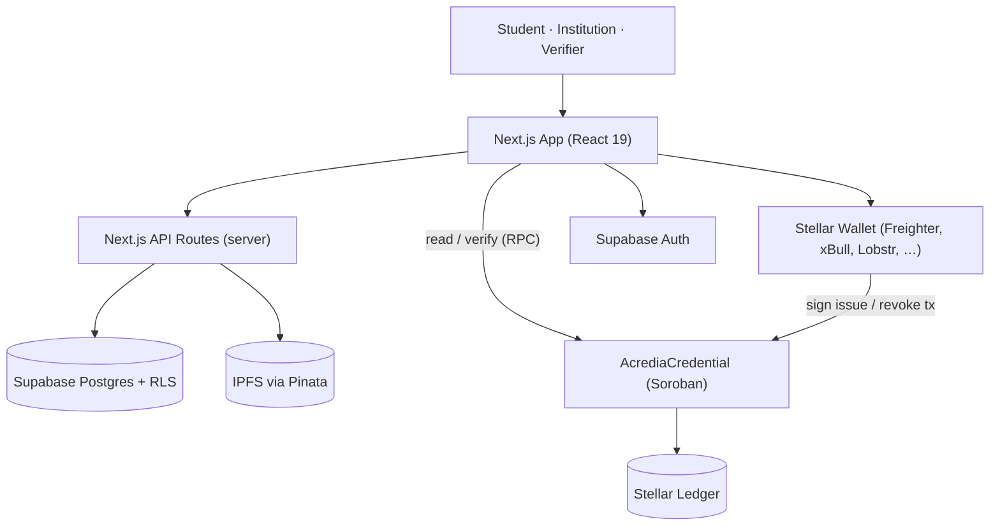

# Acredia — Architecture

How Acredia is put together, what each component is responsible for, and how data flows through the system for the three core operations: **issue**, **verify**, and **revoke**.

> Acredia runs on **Stellar testnet**. Mainnet is a configuration switch away (see the [README](../README.md) and [backlog](../ISSUE_DRAFTS.md)).

---

## 1. Component overview


```mermaid
graph TD
    U["Student · Institution · Verifier"]
    FE["Next.js App (React 19)"]
    FW["Stellar Wallet (Freighter, xBull, Lobstr, …)"]
    API["Next.js API Routes (server)"]
    AUTH["Supabase Auth"]
    DB[("Supabase Postgres + RLS")]
    IPFS[("IPFS via Pinata")]
    SC["AcrediaCredential (Soroban)"]
    L[("Stellar Ledger")]

    U --> FE
    FE --> AUTH
    FE --> FW
    FE --> API
    FE -->|"read / verify (RPC)"| SC
    FW -->|"sign issue / revoke tx"| SC
    API --> DB
    API --> IPFS
    SC --> L
```

| Component | Tech | Responsibility |
|---|---|---|
| **Frontend** | Next.js 16 (App Router), React 19, Tailwind v4 | Marketing site, dashboards, verification UI; also hosts server API routes. |
| **Auth** | Supabase Auth | Email/password sessions, JWTs; role is resolved server-side (never from client metadata alone). |
| **Wallet** | Stellar Wallets Kit (`@creit.tech/stellar-wallets-kit`) | Connects any of nine registered Stellar wallets and signs `issue_credential` / `revoke_credential` transactions. See [§7 Wallet integration](#7-wallet-integration). |
| **Smart contract** | Rust + Soroban SDK (`AcrediaCredential`) | On-chain source of truth: issuance, issuer authorization, revocation, TTL/persistence, events. |
| **Ledger / RPC** | Stellar (testnet), Soroban RPC, Horizon | Transaction settlement and contract reads. |
| **Storage** | IPFS via Pinata | Stores the credential document + metadata (public today; encryption is on the roadmap). |
| **Database** | Supabase Postgres + Row Level Security | Off-chain index for fast reads, filtering, pagination, and analytics; stores profiles, institution/student records, credential index, and privacy-safe verification logs. |

---

## 2. Layers

1. **Presentation** — one role-aware console (`ConsoleShell` + `src/lib/consoleNav.ts`) serving students, institutions, and admins, plus a public verify page. Design system built on Tailwind v4 tokens + Radix primitives. Admins have a single console at `/admin`; `/dashboard` redirects them there — see [decisions/0001](decisions/0001-single-admin-console.md).
2. **Application** — Next.js API routes handle privileged work server-side: student/institution provisioning, wallet linking, admin stats, IPFS pinning, and verification logging. Server-only secrets never reach the client bundle.
3. **Blockchain** — the `AcrediaCredential` Soroban contract is the authoritative record. It gates issuance behind owner-approved issuer authorization and keeps credentials persistent via explicit TTL extension.
4. **Storage** — documents/metadata are content-addressed on IPFS; only a hash + IPFS URI are anchored on-chain.
5. **Data** — Postgres mirrors on-chain state for querying, protected by Row Level Security so users can only read their own rows (with admin policies for oversight).

---

## 3. Database Management & Migrations

Acredia manages the PostgreSQL schema, seed data, and backups using the **Supabase CLI**.

- **Migrations**: The database schema is defined as versioned migrations in `frontend/supabase/migrations/`. 
  - To apply migrations locally, run `npx supabase db push` or simply `npx supabase start`.
  - To create a new migration: `npx supabase migration new <descriptive-name>`.
- **Seed Data**: Dummy users, institutions, and credentials for local development are managed in `frontend/supabase/seed.sql`. When starting a local Supabase environment, the seed data is populated automatically.
- **Backups & Restore**: Automated logical backups can be run via npm scripts:
  - `npm run db:backup` -> Dumps the current `public` schema and data into `frontend/supabase/backups/`.
  - `npm run db:restore path/to/backup.sql` -> Restores a logical dump to the database (requires `psql` or the Supabase CLI).

---

## 3. Trust & security model

- **On-chain is the source of truth.** The database is a convenience index; verification ultimately rests on the contract + hash.
- **Only a hash goes on-chain** — no PII. The SHA-256 hash is computed over the canonical credential payload; verification recomputes and compares it.
- **Issuer authorization is owner-gated.** Only the contract owner can `authorize_issuer`; only authorized addresses can issue; only the issuing address can revoke its own credentials.
- **Role resolution is server-side.** UI role never grants privilege on its own; API routes and Postgres RLS enforce access.
- **Server secrets stay server-side.** Service-role key, Pinata JWT, and the verification-log hash secret are never exposed as `NEXT_PUBLIC_*`.

See the [roadmap backlog](../ISSUE_DRAFTS.md) for planned hardening: encrypting IPFS payloads, distributed rate limiting, an off-chain event indexer, and an independent contract audit.

---

## 4. Data flows

### 4.1 Issue a credential
1. A **verified institution** connects its Stellar wallet (any [supported wallet](#7-wallet-integration)), which is linked to the institution profile.
2. The registrar fills the issuance form (student wallet, degree, subjects, document).
3. The document + metadata are **pinned to IPFS** (via a server API route using the Pinata JWT), returning an IPFS URI/CID.
4. A **SHA-256 hash** is computed over the canonical credential payload.
5. The issuer **signs `issue_credential(student, issuer, credential_hash, ipfs_uri)`**; the contract verifies the issuer is authorized, rejects duplicate hashes, assigns a `token_id`, stores the credential in persistent storage, extends its TTL, and emits a `cred_iss` event.
6. The credential is **indexed in Postgres** for the student's and institution's dashboards.

### 4.2 Verify a credential
1. Anyone opens `/verify` with a token ID (typed, from a link, or scanned QR) — **no login required**.
2. The app **reads the credential from the contract** via Soroban RPC (`get_credential` / `verify_credential`).
3. It presents **authenticity + revocation status** and the credential details.
4. A **privacy-safe entry** (hashed identifiers) is recorded in `verification_logs`.
5. *(Roadmap)* an explicit **integrity check** recomputes the hash of the retrieved payload and confirms the IPFS CID matches the on-chain record.

### 4.3 Revoke a credential
1. The **original issuing institution** connects the same wallet that issued the credential.
2. It **signs `revoke_credential(token_id, issuer)`**; the contract confirms the caller is the issuer and flags the credential `revoked` (the record stays readable so verifiers see **"revoked"**, not "missing"), emitting a `cred_rev` event.
3. The **index is updated**, and the credential shows as revoked everywhere.

---

## 5. The smart contract (summary)

`AcrediaCredential` (see [`contracts/`](../contracts/) and [`contracts/README.md`](../contracts/README.md)) provides:

- **Ownership & governance:** `initialize`, `transfer_owner` / `accept_owner` (two-step), `upgrade`, `migrate`, `get_storage_version`.
- **Issuer authorization:** `authorize_issuer`, `revoke_issuer`, `is_authorized_issuer` (persistent storage with migration from legacy instance storage).
- **Credentials:** `issue_credential`, `revoke_credential`, `get_credential`, `verify_credential` (by hash), `is_revoked`, `total_credentials`.
- **Persistence:** explicit TTL extension on every read/write plus a permissionless `bump_credential` so anyone (or a keeper) can keep a credential alive without issuer authority.
- **Events:** `cred_iss`, `cred_rev`, `iss_auth`, `iss_rev`, and ownership events — the basis for the planned off-chain indexer.

---

## 6. Environments & configuration

Network selection and endpoints are driven by environment variables and validated at boot (`frontend/src/lib/runtimeConfig.ts`). Key public config: `NEXT_PUBLIC_STELLAR_NETWORK`, contract addresses, Supabase URL/anon key, Pinata gateway. Server-only: `SUPABASE_SERVICE_ROLE_KEY`, `PINATA_JWT`, `VERIFICATION_LOG_HASH_SECRET`, `ADMIN_EMAIL_ALLOWLIST`. See the README's **Environment Setup** for the full list.

**Testnet now / mainnet later:** switching networks is a config change (network + contract addresses); misconfiguration is rejected at build/boot.

See **[mainnet-readiness.md](mainnet-readiness.md)** for the current readiness
status, the remaining blockers, and the cutover procedure.

---

## 7. Wallet integration

Acredia connects through [Stellar Wallets Kit](https://github.com/Creit-Tech/Stellar-Wallets-Kit)
(MIT, listed in the [official Stellar wallet-integration docs](https://developers.stellar.org/docs/build/apps/wallet-integration)),
which covers Freighter, xBull, Albedo, Rabet, Lobstr, Hana, Klever, OneKey
and Bitget. The supported-wallet matrix, including which wallets can complete
the `/claim` flow, is in the [README](../README.md#-supported-wallets).

### The signing seam

Contract calls take a **signer**, not an address (ACREDIA-STELLAR#3).
`src/lib/contracts.ts` builds, simulates and submits Soroban transactions; who
holds the key is a separate concern:

```ts
export interface StellarSigner {
    readonly address: string;
    signTransaction(xdr: string, opts: { networkPassphrase: string }): Promise<string>;
    signMessage?(message: string, opts: { networkPassphrase: string }): Promise<string>;
}
```

Four implementations, in `src/lib/stellarSigner.ts` unless noted:

| Signer | Used by |
| --- | --- |
| `createWalletSigner` (`src/lib/wallet/signer.ts`) | The browser. The only bridge from the wallet layer to this interface. |
| `createKeypairSigner` | Tests, and any future server-side keeper or relayer. Signs locally — no prompt, no extension. |
| `createE2eSigner` (`src/lib/e2eLedger.ts`) | The Playwright suite. |
| `createReadOnlySigner` | Contexts that must name an address but hold no key. Throws rather than returning an unsigned transaction. |

`contracts.ts` previously imported `signTransaction` from
`@stellar/freighter-api` at line 1, which cost three things:

- **`invokeContractMethod` was untestable.** Reaching it meant stubbing a browser
  extension, so `contracts.test.ts` could only cover the pure helpers around it —
  leaving the build → simulate → sign → submit → confirm sequence unexercised.
  It is now covered end-to-end in
  [`tests/contractsInvoke.test.ts`](../frontend/tests/contractsInvoke.test.ts)
  with a keypair signer and a stubbed RPC.
- **Six duplicated E2E forks.** Every exported function opened with a
  `getE2eState()` early return that re-implemented the logic it was bypassing —
  authorization checks in three places, token-id sequencing in two. Two
  implementations of the same rules, only one of them real. They now collapse
  into `src/lib/ledgerGateway.ts`: one execution boundary chooses the real
  implementation or fake ledger for all six operations. `contracts.ts` has no
  fake-signer branches. Test state and fake authorization live in `e2eLedger.ts`.
- **Server-side signing was impossible** without editing the module.

Read-only functions (`getContractOwner`, `isAuthorizedIssuer`) deliberately keep
taking a plain address. They only simulate, and one caller is a server API route
with no wallet at all — a signer there would be a dependency nothing could
satisfy. They use the same ledger gateway as writes. A fake read result of `false` is
preserved; only `null` means that the real implementation should run.

`contracts.ts` now imports no wallet SDK and never calls `getE2eState`; both are
asserted in
[`tests/e2eLedger.test.ts`](../frontend/tests/e2eLedger.test.ts).

### Why there is an adapter

Acredia previously supported exactly one wallet, and the reason was structural:
`@stellar/freighter-api` was imported directly in three separate layers — the
connection context, the contract-signing helper, and the `/claim` page. Adding
a second wallet meant touching all three, so it never happened, and
single-wallet lock-in became an adoption ceiling for a product whose whole
promise is universal, lifelong access (ACREDIA-STELLAR#272).

The fix is a boundary, not just a library swap:

```
contracts.ts ──► StellarSigner  (src/lib/stellarSigner.ts)
                      ▲   ▲
                      │   └── createKeypairSigner / createE2eSigner
                      │
UI / contexts ──► createWalletSigner (src/lib/wallet/signer.ts)
                      │
                  WalletAdapter (src/lib/wallet/types.ts)
                      │
                  src/lib/wallet/index.ts    ← E2E short-circuit
                      │
                  src/lib/wallet/adapter.ts  ← the ONLY kit importer
                      │
                  @creit.tech/stellar-wallets-kit
```

`src/lib/wallet/` is the only place a wallet library may be imported.
That is enforced twice, because a convention alone is what failed the first time:

- **ESLint** — `no-restricted-imports` in `eslint.config.mjs` fails the build on
  any import of the kit or `@stellar/freighter-api` outside `src/lib/wallet/`.
- **A test** — `frontend/tests/walletBoundary.test.ts` walks the source tree and
  asserts the same thing, because a lint rule can be silenced with an inline
  disable comment and a test notices when it is.

### Capability gaps are explicit

Not every wallet implements every operation, and the kit's types do not
distinguish them: registered modules declare `signMessage`, but **Albedo and Rabet reject
it at runtime**. `/claim` proves wallet ownership *by* signing a message, so a
student on one of those wallets would connect successfully and dead-end at the
final step.

`src/lib/wallet/capabilities.ts` records what each wallet can actually do, and
`useStellarAccount()` exposes it as `capabilities`, so the claim page withholds
the form and names the problem on connect rather than after the form is filled.
An unknown wallet id is assumed capable — a wallet added by a future kit release
should work by default, and the cost of guessing wrong is an error at signing
time rather than a wallet we decline to offer.

### Signature normalisation

Wallets disagree about what a signature *is*: base64 (most), a `Uint8Array`
(Freighter v3), or lowercase hex (Bitget). The disagreement is silent — every
shape is a plausible-looking value, so getting it wrong produces a failed
*verification* rather than a parse error, which reads to the student as "your
wallet is wrong". `normalizeSignedMessage` in `src/lib/walletOwnership.ts`
funnels all three to base64, detecting hex by shape rather than by asking which
wallet signed.

### Network selection

The kit's network comes solely from `activeNetwork` (`src/lib/stellar.ts`), never
a literal. A kit pinned to testnet while the app runs on mainnet would sign
against the wrong ledger, and the resulting "network mismatch" is the kind of
error users blame on their wallet rather than on us. An unrecognised passphrase
is rejected before initializing the Kit rather than silently changing networks.

### Silent restore never prompts

Acredia persists the chosen wallet id; the Kit separately caches the connected
address in its own storage. Restore displays a cached session. `WalletAdapter.restore()` must never open a wallet
popup: it runs without a user gesture, so a prompt there is hostile, is commonly
blocked by the browser, and for hardware wallets can leave a device waiting on
input nobody asked for. The adapter reads the cached address (`getAddress`); it does not establish
that current wallet permissions remain valid. During explicit transaction or
message signing, `fetchAddress` refreshes permissions and the selected account.
An account change rejects the operation before signature approval. Restore
never calls `fetchAddress` or `authModal`; tests enforce both paths.

### Modal accessibility

The kit's selection modal is themed from the app's CSS custom properties
(`src/lib/wallet/theme.ts`) rather than shipped with its default blue-and-grey
look — it is the screen users meet *before* deciding to trust us with a wallet.

Upstream a11y gaps are repaired in `src/lib/wallet/modalA11y.ts`, neither of
them configurable (the kit's internal `Button` takes no label prop):

1. The header's icon-only help/back/close buttons carry no accessible name — a
   **critical** axe `button-name` violation; a screen reader announced them as
   "button, button".
2. The overlay has no `role="dialog"` and no `aria-modal`, so assistive
   technology presented it as ordinary page content.

Measured with axe-core against the real modal in Chromium, before and after:
**1 critical violation → 0 violations across all axe rules**. Both repairs check
for the *absence* of the attribute, so each becomes a no-op once the kit fixes
it upstream. Acredia also wraps keyboard focus within the dialog, closes through
the Kit's own close button on Escape and restores focus to the initiating
control after the auth promise re-enables it.

### Adding a wallet

1. Register the module in `loadKit()` in `src/lib/wallet/adapter.ts` (import it
   by subpath — `@creit.tech/stellar-wallets-kit/modules/<name>` — so unused
   wallet code stays out of the bundle).
2. Add its display name to `WALLET_NAMES` in the same file.
3. Check the kit's module source for `signMessage`. If it throws, add the id to
   `NO_MESSAGE_SIGNING` in `src/lib/wallet/capabilities.ts` — the types will not
   tell you.
4. Run the per-wallet manual matrix in
   [`frontend/tests/TEST_STRATEGY.md`](../frontend/tests/TEST_STRATEGY.md#per-wallet-verification-matrix):
   signing must be re-verified per wallet, because response shapes differ.


### Wallet transport policy

The CSP explicitly permits WalletConnect HTTPS/WSS relay origins, scoped
verification frames, Albedo frames and Kit wallet icons. It retains
`frame-ancestors 'none'`, nonce-based script execution and no unrestricted
connection/frame wildcard. `walletModal.spec.ts` runs the actual Kit modal,
checks keyboard focus wrapping, Escape dismissal, focus restoration and axe,
and checks HTTP/frame requests under the production CSP using intercepted
transport responses. It does not prove a live relay session or wallet signature.
HOT Wallet is disabled until its network and browser runtime limitations are
resolved; see the README capability table.
